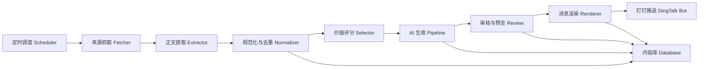

# 教师内容提醒系统技术设计

## 1. 设计目标

- 以“来源接入简单、内容加工稳定、推送链路可追踪”为核心
- 先满足单实例部署和少量来源接入
- 保证后续可以平滑扩展到更多来源、更多模板、更多推送目标

## 2. 总体架构

## 3. 系统模块划分

### 3.1 Scheduler

职责：

- 按来源配置触发抓取任务
- 控制并发
- 支持失败重试
- 记录任务执行状态

MVP 方案：

- `APScheduler` 或系统 Cron 调用应用命令

后续升级：

- `Celery Beat`、`Temporal` 或独立任务编排

### 3.2 Source Fetcher

职责：

- 拉取 RSS、栏目页、文章页
- 解析链接列表
- 补全文章元信息

建议能力：

- 支持 `rss`
- 支持 `html_list`
- 支持 `html_detail`
- 支持自定义请求头和超时
- 支持来源级抓取策略

### 3.3 Content Extractor

职责：

- 从文章页面提取标题、正文、时间、作者、图片
- 清洗无关区块
- 生成统一的原始文章对象

建议工具：

- `trafilatura`
- `readability-lxml`
- `BeautifulSoup`

降级策略：

- 先走站点专属规则
- 再走通用正文提取
- 提取失败进入人工检查队列

### 3.4 Normalizer & Deduplicator

职责：

- 标准化日期、来源、标签
- 生成文章指纹
- 做 URL 去重与文本相似度去重

建议去重方式：

- URL 哈希去重
- 标题相似度去重
- 正文段落摘要向量或 SimHash 去重

### 3.5 Selector

职责：

- 对候选内容进行打分和过滤
- 判定是否进入 AI 生成流程

建议评分维度：

- 新鲜度
- 趣味度
- 教学适配度
- 信息密度
- 可出题性
- 安全性

建议分数示例：

`total_score = 0.25 * freshness + 0.2 * interest + 0.25 * teachability + 0.15 * info_density + 0.15 * exercise_potential`

默认阈值：

- `>= 75` 进入生成
- `60-74` 进入候选池待人工复核
- `< 60` 丢弃

### 3.6 AI 生成 Pipeline

建议拆成多步，而不是一次性大 Prompt：

1. 事实提取
2. 标题与摘要生成
3. 教学价值说明
4. 改写英文阅读材料
5. 题目生成
6. 答案与解析生成
7. 最终一致性校验

这样可以提升稳定性，也便于缓存与重试。

### 3.7 Review & Approval

职责：

- 展示候选内容预览
- 审核人修改标题、摘要、题目
- 选择发送模板
- 确认发送

MVP 方案：

- 管理命令行预览
- 简单 API + Web 页面
- 或先生成 Markdown 预览文件

### 3.8 Renderer

职责：

- 把结构化内容转换为钉钉可发送格式
- 支持模板切换

模板建议：

- 晨读版
- 备课版
- 成人阅读版
- 简版快讯

### 3.9 DingTalk Delivery

职责：

- 调用钉钉机器人 webhook
- 记录发送结果
- 异常重试

建议处理：

- 统一封装消息发送 SDK
- 记录 request / response / retry_count / status

## 4. 核心数据流

### 4.1 抓取流程

1. Scheduler 触发来源任务
2. Fetcher 获取候选文章链接
3. Extractor 提取正文
4. Normalizer 完成标准化和去重
5. Selector 打分
6. 高分内容进入生成队列

### 4.2 内容生产流程

1. 读取原始文章
2. 生成结构化事实卡
3. 生成摘要和标题
4. 生成英文阅读材料
5. 生成题目和答案
6. 做一致性检查
7. 进入预览/审核

### 4.3 推送流程

1. 选择已审核内容
2. 组装消息模板
3. 发送到钉钉
4. 写入投递日志

## 5. 数据模型建议

## 5.1 `sources`

- `id`
- `name`
- `category`
- `type`
- `base_url`
- `entry_url`
- `enabled`
- `priority`
- `schedule_cron`
- `extract_rules`
- `created_at`
- `updated_at`

## 5.2 `raw_articles`

- `id`
- `source_id`
- `source_url`
- `canonical_url`
- `title`
- `author`
- `published_at`
- `raw_html`
- `raw_text`
- `lead_image_url`
- `language`
- `content_hash`
- `fetch_status`
- `created_at`

## 5.3 `article_scores`

- `id`
- `article_id`
- `freshness_score`
- `interest_score`
- `teachability_score`
- `info_density_score`
- `exercise_potential_score`
- `safety_score`
- `total_score`
- `reason_json`
- `created_at`

## 5.4 `content_packages`

- `id`
- `article_id`
- `target_audience`
- `difficulty_level`
- `optimized_title`
- `summary`
- `teaching_value`
- `reading_passage`
- `keywords_json`
- `discussion_points_json`
- `cover_image_url`
- `generation_status`
- `traceability_json`
- `created_at`
- `updated_at`

## 5.5 `exercise_sets`

- `id`
- `content_package_id`
- `exercise_type`
- `difficulty_level`
- `question_json`
- `answer_json`
- `explanation_json`
- `created_at`

## 5.6 `review_tasks`

- `id`
- `content_package_id`
- `review_status`
- `reviewer`
- `review_comment`
- `reviewed_at`

## 5.7 `delivery_jobs`

- `id`
- `content_package_id`
- `channel`
- `template_name`
- `payload_json`
- `delivery_status`
- `retry_count`
- `response_body`
- `delivered_at`

## 6. 配置设计建议

建议使用“数据库 + 配置文件”混合模式：

- 稳定的默认来源和模型参数可写在配置文件
- 运行期状态、审核、投递记录写数据库

建议配置项：

- 来源列表
- 内容比例
- 学段模板
- 题型模板
- 各来源抓取频率
- 各学段长度范围
- 价值分阈值
- 钉钉 webhook
- 是否启用人工审核

## 7. Prompt 设计原则

### 7.1 不要一步生成全部内容

应该拆 Prompt：

- `extract_facts`
- `judge_teachability`
- `rewrite_passage`
- `generate_questions`
- `generate_answers`
- `quality_check`

### 7.2 所有生成都要带输入约束

- 明确目标人群
- 明确字数范围
- 明确允许使用的信息来源
- 明确不得虚构事实
- 明确输出 JSON 结构

### 7.3 生成后必须做结构校验

- JSON schema 校验
- 字段完整性校验
- 答案是否与题目数量匹配
- 解析是否与选项一致

## 8. 难度分层规则建议

### 初中

- 篇幅短
- 高频词优先
- 长句拆分
- 题目偏事实理解

### 高中

- 保留一定信息密度
- 可以有推断题
- 可加入较少抽象概念

### 成人

- 保留背景信息
- 可加入观点判断和讨论任务
- 更强调真实表达和语境

## 9. 图片策略

优先级建议：

1. 原文主图
2. 来源页首图
3. 内部默认分类图
4. 后续扩展 AI 配图

图片字段需保留：

- 原始链接
- 来源站点
- 获取时间
- 使用策略

## 10. 消息模板建议

### 10.1 晨读版

- 标题
- 摘要
- 图片
- 阅读短文
- 阅读理解

### 10.2 备课版

- 标题
- 教学价值
- 核心词汇
- 课堂讨论点
- 题目与答案

### 10.3 成人版

- 标题
- 摘要
- 背景补充
- 阅读短文
- 讨论题

## 11. 可观测性设计

至少记录以下日志和指标：

- 抓取成功率
- 正文提取成功率
- 去重命中率
- 打分通过率
- AI 生成成功率
- 审核通过率
- 钉钉发送成功率
- 每个来源平均产出数

## 12. 安全与合规

- 不直接大段复制原站全文
- 输出以摘要、改写、教学加工为主
- 保留原文链接和来源
- 对敏感内容配置过滤规则
- 对模型输出保留审计日志

## 13. 推荐技术选型

MVP 推荐使用 Python：

- Web/API：`FastAPI`
- 抓取：`httpx`、`feedparser`、`BeautifulSoup`
- 正文提取：`trafilatura`、`readability-lxml`
- 调度：`APScheduler`
- 数据库：`PostgreSQL`
- 本地开发：`SQLite` 可作为初期替代
- 队列：MVP 可先同步执行，后续接入 `Redis + Celery`
- 模型适配：封装统一 `LLMClient`

选择 Python 的原因：

- 抓取和正文提取生态成熟
- 文本处理和任务编排灵活
- 后续引入评估、打分、向量相似度更方便
